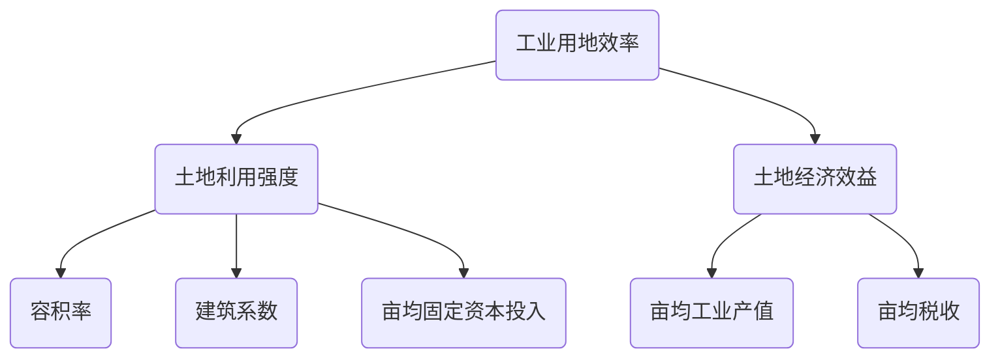
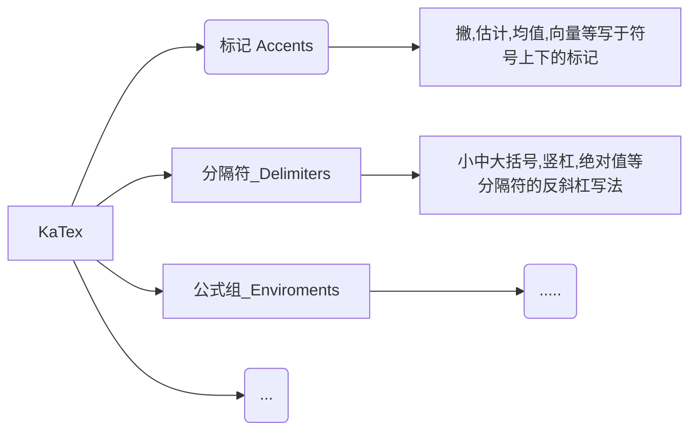

[TOC]

# 阅读

### 如何训练思维的深度？

------》==5why法（向前追因） 和 5so法（向后追果）==

https://www.zhihu.com/question/19553569/answer/208715100?utm_source=wechat_session&utm_medium=social&utm_oi=903075405244817408&utm_content=group1_Answer&utm_campaign=shareopn

思维的深度，可以说就是==逻辑链==条的长度。

5why法，简单来说就是**连续追问为什么，寻找==问题的根因==**==。

**一个合理的层次是：==追问到问题变得没有意义为止==**。

为什么东边的墙上有很多鸟粪？

调查发现，原来是因为墙上有很多蜘蛛，而这些鸟以蜘蛛为食，所以经常在墙附近活动。

为什么墙上有很多蜘蛛？

因为墙上有很多小虫子，而蜘蛛以这些小虫子为食。

为什么墙上有很多小虫子？

因为东面墙上有几扇窗子，半晚时候博物馆里的光会从这里透出去，而这些趋光性很强的虫子就被光吸引过来了。

所以，正确的解决问题方法应该是，在窗户那里安装遮光性很强的厚窗帘，这样就能彻底解决问题了。

**5 so法**

比如金融投资。比如几年前国家发布多个政策，多个场合明确表示要进行产业转型。

So？

新能源汽车是产业转型的重要方向之一。

So？

新能源汽车将会迎来很高的产量爆发（新能源汽车股票值得投资）。

So？

锂电池作为新能源汽车核心部件，其需求量会暴增（锂电池股票值得投资）

So？

锂矿作为锂电池原料，起需求量会暴增（锂矿股票值得投资）

### 思考快与慢：

### 穷查理宝典

### 如何成为某一技术领域的高手？

1、学会拆解

2、对拆解后的专项做强加联系！！！！！！

# 投资

### 1、投资，就是找==现在不合理，而未来又是必然的==

### 2、==任何一件大事情==，起来的时候，背后都会有经济活动！！！！（思考自己可以做的事情，大局观，不要隐隐狗狗！！！）

对于大的行业而言--》看行业线，行业能把握
瘟疫引起的:
==增长是好事==，==萧条更是好事儿==
回去画图，推理

小的东西看不到，但是大的东西是必然的，可预测的，所以，一定对大的东西不要麻木

比如，美国大选宣布总统，诺安八个点，这个我遇见了。。。但是没能及时卖掉

认知认知认知

站在2019年11月份，根据瘟疫可以预测：假设疫情时间一年（医疗、娱乐、互联网）

真实的：

娱乐行业：

有几个==必然==：

1、大的事件必然会引起波动：积极影响的行业、消极影响的行业---》==遇到社会性的大事，一定要与全行业联想==

2、对积极影响的行业能赚钱：前期重仓买入 《----==因为增长是必然的==

3、对消极影响的行业，更容易挣钱，==更保险== ----》==前期的下降必然的，后期因素消除更是必然，只是时间线有些长！！！！==   ，所以长期定投这些行业

后期恢复更是必然！！！！

4、疫情，同样也可以用于买房

### 3、面向对象的思想：要把所有发生的事情（对象）、与自己（对象）链接！！！！！！

### 4、严格区分==突发性影响==和==永久性影响==

对于突发性的大事件，如果长期一定会恢复-----》这种稳赚不赔

永久性影响，比如公司业务逻辑变了-------》永远不要碰！！！

### 段永平

抄段永平的作业！！！！

----> 3月16号，腾讯股价增长22%

### 倾城

一直预测2022年上半年一直下跌，准确预测到真正的底部，而不是阶段的底部！！！！！！！

2022/5/2: 

赛道股：白酒、医药、权重蓝筹，先涨，后面补跌

区别对待美股与中股1！！！！！

中股票，**所有消息，只是为了解释而找来的消息**！！！！**！涨跌与经济无关！！！！只与资金有关！！（国家放水、主力资金）**

### 林园：

（1）==未来30年==医疗是主线！！！未来三年（21-24），医疗至少翻一番

（2）买垄断性公司！！！

### 买基金原则，朱少醒：

1、主要看好长期（3-5年以上）历史业绩都不错的基金经理：富国朱少醒、易方达张坤、交银三剑客
2、不要买太多基金：4-10个分散行业
3、==长期持有, 三年以上维度==！！！！！！！！！！！！！！！！！不适合短线！！！！朱少醒：我们不能买股票，如果你放在==三年以上==的时间维度，都应该投权益资产，三年以下就比较难说了。==(放到10年以上)毫无疑问是权益资产==，可以更集中到那种更长期优质的资产，你觉得置信度最好的公司，跟着公司一起慢慢变富。

4、一定要克制人的天性：追涨 + ==杀跌==！！！！杀跌是大忌!!!!!!!
5、

6，**聪明投资者：你这12年来最赚钱的股票是什么？
　　朱少醒：我平时不怎么看那个东西。**
　　不知道你有没有看过一书上的说法，小孩画画通常有两种完全不同的状态：==有的小孩边画边撕，画完就撕==；还有的小孩画好了，稍好一些好的保存在那边。可能到最后，所有的画里，画的更好的是前者。投资和这个有点类似。我可能对过去的“亮点”不是特别在意，更多是看==过程和未来==，我享受过程，在这个过程中，反而有些教训，我会记得更清楚
**从逻辑上看，最赚钱的应该是拿得最久的股票**

12，聪明投资者：你一般会招什么样的人？
　　朱少醒：研究员首先是品性要求，**好的研究员还要==独立思考==，有开放的心态、很强的==好奇心==，做事有很强的==韧性==。智商在这个行业内从来不是瓶颈，做事情的坚韧度和毅力很重要**

**关于卖点：不可控的错误和可控的错误**
　　15，聪明投资者：你怎么判断卖点？
　　朱少醒：成长类投资的卖点，其实是带有艺术成分的，比较难量化、难有明确规则。
　　第一，不断去review原来的投资框架，==买入之后，逻辑有没有发生变化==。
　　然后，==估值有没有达到你的判断==，对于成长公司来讲，这方面的权重要稍微低一些，因为犯错概率也挺高的

喜欢纯粹专注把事情做到极致的人
　　29，聪明投资者：海内外，你最欣赏的投资人是谁？
　　朱少醒：对我影响比较深的，是巴菲特和==彼得林奇==，可能我翻彼得林奇的书比巴菲特多一点，因为他跟我公募的行业属性有关

32，聪明投资者：你的价值观是什么？
　　朱少醒：我没归纳过。我觉得，做投资可能跟做人方式有关，无论是我们公司的Business、还是投资，我都希望看得==长远==。第二，我比较喜欢能够==非常纯粹专注==把事情做到==极致==

35，聪明投资者：有时候热爱它，是因为成功给了你正反馈，会不会也是一种求证陷阱，制约了你尝试新的可能？
　　朱少醒：只是享受成功带来的荣耀，跟热爱不一样。热爱就是你甚至==没有看到曙光，老是碰壁，各种怀疑的==时候，你觉得我就是==喜欢==，还能坚持，这才算。

### 巴菲特：

（1）赌指数基金就是赌国运
（2）只有傻子和偏执狂 才去预测市场的顶部和底部（即：==方向大致正确！！！！！==）不要看一时的涨与跌

价值投资《-------》找市场中的便宜货（便宜指的是，**价格/真实价值** 低！！！！，不是价格低！！！）

如何找便宜货？

（1）**所有人**都恐慌的时候  ----》绝大部分声音

### 高瓴

----》逻辑：为什么要抄高瓴？？？因为高瓴价值投资！！！持有几年，所以==季度报告延迟不影响==！！！！（所以，林园不适合抄作业！！！）

==关注==：1、最大重仓股   2、大量新增最大重仓股！！！！3、大量减持
**抓住主次**----》**大量**！！！！！

**减持**的案例：

三季度，即在9月前卖掉的，10月底的新闻

----》最终可以看出，在9月10月走掉是很好的！！！

为什么要抄袭？？？？因为我们与大机构信息不对称！！！！！！！

### 战争

乌克兰战争，会导致总体下降！！！
-----》但是，黄金，原油会大涨（**不是石油！！！**）

2022年2月24日15时，据法新社消息，俄罗斯地面部队进入乌克兰。

# 表达！！！！

## 普通聊天如何缓解尴尬？

------------`话题`来源：

# 思考

## 总

### 结构

#### ==结构==是更==本质==的东西

任何事物（无论抽象、具象），最重要的是结构。土木结构，软件结构，人脑结构，思维结构

==结构决定功能==。有了结构，功能是自然的事情。（比如，`代码所有类都new出来了，之间的相互功能，以及时序都是自然的`。。。。再比如，排兵布阵好了，怎么工作也是自然的。。。再比如，车能跑，因为圆形轮子结构）物体如此，`代码如此`，社会组织更是如此。

==结构决定行为==。A是B的妈妈（家庭结构），所以A抚养B。李阳是杨启超圈子人，所以，一直重用他。Window 在结构上包含了view体系，所以event最先是流过window，然后到rootView的

==认知与结构==。认知，主要是认知结构！！！！！每一次对结构的严重冲击是好事。比如盲人摸象

代码结构，与代码流程，代码结构是更本质的东西

-------》推论：1、基于结构，去做一切事情（去理解、去记忆、去认识、去画图、去推导、去设计、去分析原因）从结构上看问题，从结构上认识问题，从结构上想问题，万物皆结构！！

-------》2、如果出错，一定是结构认识不清

3、其次重要的是，重要结构的创建过程

所有事物都是主干与次要部分。1、2、3不是好的组织方式。包括上面

软件结构要类比具体事物结构，尤其是树。

自然理解一件事情，要忘记一件事情。比如，计算机中如何组织大量数据？树怎么生长和组织了这么多叶子？

==理解.....的本质在于理解结构==！！！！！（比如代码结构比功能，比时序更本质;  如何有个好绩效？？？？-----》`占据领导心中核心排名`）

==如果你下次不理解一些东西，问一问自己，它的结构是什么，你搞清楚了嘛？==

记忆更本质的东西

通过琐碎的问题，来看到整个结构。。。。。一定要有很多问题

==结构是记忆与理解的锚点！！==我们记不住行为，从结构的角度记忆行为很好。。。。结构是静态的-----》更容易记忆

关于**记忆锚点的选择**：记忆锚点尽量选择主结构，原因在于：可以从主结构推导次结构，反之则不行

做加法的同时，为什么要做减法？？？？----》原因：化简出主干（记忆点）
                                                                          ------》应用：做笔记，先写，~~再删~~

#### 结构之-------主次

主次是贯穿于任何事情的！！！！！（要有这个意识） **抓住了主次，人生便有了锚**
主要问题、主要矛盾、主要作业、主要流程

**任何事情，任何事物**，都要问一句，1、结构是怎样的？？问一句，2、主次是怎样的？？？ 尤其是抽象的事情 -----》比如，代码最主干的逻辑，买房子最主要的几个目的

**执行**：当分清了事物的主次，选两个以内（很多情况下，只能保证一个！！！！！！）的主次，保证这两个主要的事情达到目标即可，不管其他细节，最好不完美（这样证明两个主要的目标保证了）

例子1：买房的主次是什么？---》增值+学区是首要的！！！！！

​           买合肥房子最大的失误是什么？**省政府南迁**，比地铁是主

​          上海房子没有学区，原因：那段时间学区房大降，学区政策还没定下来

例子2：每天干的事情的主次是啥？**完成某一部分代码**  不能因为修补房子，干了一天，恋于修正房子

例子3：简单粗暴往往很有效，比细致分析  ------》抓住主
例子4：代数中，很多个参数，可以组成一个特征量？？？？？？？？？

#### 结构之-------锚

很多时候，主次可以提现锚

#### 认识结构的工具

如何认识结构？如何区别结构的主次？如何避免分析过程中的遗忘甚至颠倒主次？

思维导图

### 思考模式、驱动模式

对于重要的事情，持续问问题 ------->作为课题
然后`写出答案`（只有纸面上，才能在脑中成体系，才能清晰）

## 人生架构

身体》脑子》

关系：身体会影响脑子

坐久了，会影响思维
思考久了，容易睡不着 ---->利用身体运动反作用

## 心理

任何行为都是心理、激素作用？？

每天暗示自己：（1）你是个天才  （2）这个原理让我高潮  （3）人际关系的拿捏、权利让我高潮

### 成瘾

当你临时深渊的时候，深渊也在临时你
人不可能抵御诱惑，只能远离
念起即断
自由始终是自律的自由，不是放纵的自由

看书，不看视频

### 焦虑

### 假装

你想成为什么样的人，**先从假装开始（先从暗示开始）**

## 其他小点

如何鉴定一个view是特定某个？1、在断点调试中，会标明子类名 2、log中大小 3、眼睛观察时，可以改变大小（最好颜色）
---------》区别化

面向对象，什么时候new，比什么时候调用方法要重要！！！前者是基础

==充分涌流==，英文对编程很重要，可以在网上链接全世界的开发者和网站！！！！！

好的断点调试环境下，可以调试z侧的Zeus

我是个笨人。。。笨人理解事物的方式就是，
1、慢化:  不停地细化、分解问题，然后一条条回答，确定 
一定要梳理，q&a，否则跟没做过一样，比如输入法
画完图没有用，太泛
2、记录，与回顾
3，任何事情都要有   更抽象。。。。。这才是你的。你忘不掉的

任何时候，非主线程需要标识！！！！！

按照功能去分层，分类！分代码

如何界定真懂和假懂

做项目工程或者阅读代码时，一定要有文档输出。1，理思路 2 记忆 3 回顾

我跟周围领域边界是什么。。。。跟周边啥关系

绑定，addwin，bind

记忆之锚

万物皆对象与关系（对象的高级就是架构）

测试用例方法:一步一步走。。。。不要跳跃！！！
刷完版本，点hipay
更新代码，导入so，点hipay

不要走捷径，走捷径会让你死的很惨

测试用例不过，
1，绑定关系原则:测试套里其他的过没过？
2，相互影响关系原则:为了排除测试用例之间的影响，

不要被自己骗了。。。。问一句，不这么样，又会怎样？如果没有，你会怎么做？

理清，透彻！！！！如何达到呢？
如何不囿于代码？？

### ==每前进一步，把之前所有方法再轮一遍，方法便成指数级增长==

例子：

1、进步:云帆引入方法，可以将其他盘代码引入As工程源码作为source
基于进步的拓展:那么可以做的事情就非常多了，比如将Z侧代码引入source断点调试，依赖源码

再拓展: 打通ndk调试（A侧和Z侧），以同样方法引入cpp

再再拓展:

2、云构建ok了，其实可以做很多事情。。。。
比如，串所有代码？
再比如，

### 每天给你自己暗示，你是计算机天才，高手

### 永远==不要用毅力、努力==，因为它有对应的副作用同样强！！！！

太用力跑不远！！！！
股市上也是，太要快，反而跌的惨

### 对比，一定要强烈、一定要客观

例子：
1、如果练好说话：把自己说的话录音（==客观==）下来，与别人同样的话录音下来，同时放映对比（==强烈==）
2、看自己胖不胖：用手机后置摄像头（==客观==）拍照片，对比以前照片

### 坚持每天输出，以输出倒逼理解！！！！(关键是，==倒逼思考==)

任何学习都是如此
读书也是如此:  输入（看书）+头脑内整合（思考）——>输出（写作）=收获
理解事物也是如此

### 跟对人、读好的书、好的csdn----》学会挑选，避免糟粕！！！！！

==如何挑选？看评价，长期的==！！！！

大量的信息涌进来，鱼龙混杂----》大部分观点是错的！！
----------------》所以，要跟对人！！！！跟对==时间上检验过==的人！！！
----------------》即使你自己没有独立思考能力，跟对了人，也就。。。

### 如何深刻？学习、知识、理解

1、要反向才能深刻----》==时刻提问题，时刻怀疑==！！！！！！

所以，我们可以推导出任意事物的学习方法：
任何学习一定是伴着很多问题的：==1、自己给自己提问题   2、网上搜面试问题（别人给你提的问题）==

2、`实践` + `实践后的总结` 才能深刻

要学一个东西，`一定要尽量实践`，比如做题、比如动手实验、比如动手写代码、写项目 
--------->纸上得来终觉浅（听人说也是如此）

### 问题

问题是技术存在的唯一理由
==一个人有多牛在于他能解多难的问题==
问题是检验技术的唯一标准
==只有好的问题才能让人深刻==！！！！

### 执行力

对于有拖延症和慢性格的你来说，执行要比理解全，要重要。。。大于一切！！！！！

### 绩效问题：

绩效b，你的问题在于不会展示自我！！！不够自信！！！主管不相信你
https://zhuanlan.zhihu.com/p/30489002?utm_source=wechat_session&utm_medium=social&utm_oi=903075405244817408&utm_campaign=shareopn

云帆: 当时给浩哥留下了好印象（==弄好了编译，让代码跑起来==）-----》后面好活都让他做了！！！！为什么我没有做到？？我当时只想着查接口资料。。。我似乎也不知道系统代码可以替换的！！！！！！
冬郎: 会**表现**，尤其领导面前-------->知识管理！！！！而我认为这些没有用！！！！
朱明亮：你能够独当一面嘛？？？技术上呢嘛，气势上呢嘛？
海涛：如何绩效好？两种：1、你在**重要的角色**上，==这个项目没了你==，其他人很难完成这个角色（至少做起来比较困难）  2、**简单的事情上，做出亮点**。做的漂亮。

**你的绩效总是垫底，不感到委屈吗？**

年中绩效评价时，其中一个团队成员问我，为什么自己的工作量并不比别人差，但是绩效排名却不理想。

好吧，这个问题对于很多管理者来说着实是一件头疼的事情。但作为团队leader，总有一天要面对这类问题。我也只能根据我的理解去给他一些建议：

为什么一起入职的小伙伴，短短的一段时间后就在绩效考核上拉开了差距呢？

我们建立一个较为理想的模型：我们将团队的工作任务看作一块三明治，分为困难、普通以及简单任务，在对团队成员并不存在主观偏见的情况下，leader会倾向于按照**“平均”**的原则去分配工作。

一般情况下，所得到的最终结果会是：有人完成的很理想，有些人完成的很差。但是，从团队绩效的整体完成情况来看，并不理想。

可以预见的是，如果继续按照上述方式分配工作，团队绩效依然无法有较大的改观，此时，作为leader不得不作出一些调整——**按照能力去匹配工作**。

带来的效果一般也是显而易见的，团队整体的绩效得到了保证。

现在回到最初的问题，我们心里是否有答案了呢：

丙的工作量并不比其它人少，为什么绩效排名靠后？

我想答案可以简单概括为，**丙的可替代性较高**。

进一步去思考，可以将以上过程称为**绩效阶层分化**。通俗的说，我们以往的工作效果导致了我们被划分为了甲类、乙类以及丙类员工（为了便于理解，暂且这样称呼）中的一种，而leader出于对团队绩效负责的原则，采取了最低风险的工作分配方式，更加剧了**绩效阶层的固化。**

丙类员工的悲哀在于，他就像站在拥挤的地铁车厢门口的人，稍不注意便会被挤下车。然而，我们被划分至丙类员工并不是最糟糕的事情，最糟糕的是**我们从未去思考自己是如何一步步走向丙类的。**

经了过对绩效阶层分化的理解，看上去作为丙类员工的我们似乎已经无路可走了。事实真的是这样吗？回顾上面的思考过程，我们会发现导致我们一步步走向丙类的直接原因，便是对于复杂、重要工作任务完成的效果差。而根本原因，在于能力缺失，或态度消极。在职场上的一条永远成立的定律：**先有做事情的能力，才会有做事情的机会。**

因此，扭转局面的唯一机会便是：**踏踏实实地提升自身的能力，去主动承担并且完成复杂、重要的工作。**绩效与薪资挂钩往往使大家捡了芝麻丢了西瓜，仅仅纠结于眼前的利益，而忘记了改进自身能力去追求自身更高价值的机会。不善于反思自己，将绩效评价结果简单地归结于偏见，甚至更加消极怠工，是对自身最大的不负责。

最后，我所理解的绩效考核的最终目的是帮助员工去发现、理解及改进自身问题，因此完整的绩效评价应该包括结果评价、绩效面谈辅导两个主要部分。也就是说，这是一个工作效果集中复盘，帮助团队成员发现成长机会，并且与他一起制定提升措施的过程，按PDCA模式去挖掘自身潜力。

许多管理者甚至将绩效考核权利当成自己树立威信的杀手锏，如果你偏要拿出一副“老子说谁行谁就行”的嘴脸，那我也只能祝你以及你的团队好运了。。。。。

### TODO：

了解impl与接口关系，为什么要这样设计

泡脚

静态方法如果修改一个量，基本上都要加锁
——》因为不同线程会同时修改这个值

你在华为，做的最大的错事就是，你太怂了！！！！！！导致了后面一系列问题，绩效，分的蛋糕

任何一个新名词，任何一个新逻辑，任何一件事情，都问一句:本质是啥（what)？最底层逻辑是啥（how)？（害怕被名词欺骗，害怕被自己骗）
不停地what，when，how，why————》不停进行交替，这样你可以追到本质
比如，序列化，本质是啥

工作逻辑
原理逻辑

做的笔记，必须是自己的深刻理解（1，自己的  2，深刻浓缩）

一个模块的开发，一定由上至下来设计接口。由上至下来写接口。。。。。为什么是这样的？因为一个接口的功能是由它的调用者决定的！！！使用者

父类调想要调到子类方法:
可以直接在子类里增加，instance判断
2 父类增加这个方法，子类复写（不用父类里用instanceof 判断）
只是子类的方法，不要在父类里
====》各有什么优劣？
第二种更好，原因在于:第一种在父类里了解了当前类是子类，即父类了解了子类逻辑，并调用子类逻辑。。。。===》子类逻辑下沉到父类里了。。。这不好，产生了耦合，以后。。。。。这样做，父类里会有大量instanceof
尤其是父类里面引用了子类===》这本身就是耦合，本身引用方向就很不对！！！
原则，父类不需要对子类是哪一种进行感知。。。做自己的逻辑，这样不会耦合？
即使只有一个子类去override，还是第二种好
例子:

如何hook安卓流程
1，实现安卓所要的接口抽象，塞给安卓。。安卓回调时，回调到z
比如，无障碍流程
2，继承安卓的类，==恶意复写==
比如元能力恶意复写activity的内容

静态如何调用非静态？
静态不能在方法中调用，但是，可以把非静态变量赋值给静态变量
而且方法可以当做callback（变量)，所以，非静态可以转化静态
-----》例如安卓Toast,  Notication

其实有些架构是必然的，比如，通知，要考虑不同应用，则必然manager在另一个进程里

为什么？为什么？为什么？

回调，回调到子类还是父类？（其实都是一个实例，层次不一样）其实都可以，哪种更合理？

读书最重要的是读目录，尤其是技术书！！！！比如安卓艺术探索艺术

断点调试适合向下

每天要有计划。。。规定，所有的计划要细化。。。。所有的学习或新东西，要输出东西
集中精力

一定要学会化简！！！！！比如，看代码要学会化简。。。把握住核心的几行代码。然后去理解与记忆。。。其他代码能删则删。。。这想要那也想要，最后一定是不深刻！！！！！！

你是一只狼

大计划，接下来追求:
1，每天锻炼身体——》细化
2，锻炼脑袋——》对知识和金钱保持
强烈欲望！！！好奇好奇，可以走得更远
3，审视每个想法。念起即断
4，反思。复盘一切
5，每天身体和思想都清零，

以输出倒逼理解。。。又一例子，做笔记，做的笔记是你的理解。而不是你抄黑板
又一例子，写toast代码给开发者，先设计好开发者怎么用，以此输出为出发点

对外接口是一个类（模块)存在的意义以及其本质！！！！！！！
要想把握一个模块，一定牢牢把握其对外接口。比如，了解一个接口怎么使用，入口在demo里。再比如，了解一个类是干啥的，看其有哪些对外接口。。。

如何让她意识到自己的错误。走她的路，让她明白。。。生日时，她没给祝福，生气。没给礼物时，生气！

如何克服焦虑和拖延: 努力干砸每一件事情！干就完了！

从本质上讲，调用函数就是信息传递！！！就是蝌蚪，电流
===》传递了两个信息: 1 、某个事 2、干这个事的一些东西   
====》其中1，可以转化为2

### 对个人成长无益

价值，价值

### to整理

  人世间有太多的羁绊，阻碍你的前进：性欲、面子、强迫症、手机、感情、亲情、执念、

要思考怎么进步，这才是根本

万物皆是对象

既然是对象，必然有层！！！！

====》所有事情，分层！！！！0层设计！！！

问题集:

问题比对的东西重要！！！！

问题《====》根因

熬夜➕久坐，伤神

熬夜会变笨

餐巾纸

放慢大招：  luyin、log

====》录音别人的问题，问题是理解本质的神器

可叠加式进步

朝闻道夕死可矣

遇到难的问题，一时解决不了，不要强攻。。。。隔一段时间再解决（第一，不耗精力，第二，换脑子）

用输出检验输入，检验理解

注意每天给自己清零

机器要一直跑，人要常休息、常思考。

沉下去

要活的有智慧

长度

书籍:稀缺，穷爸爸富爸爸

抓crash log是虚拟机在死亡之前发出来的。所以跟安卓或者z没有关系。

方向性问题，一定不要听你同级别同年龄的人，的话，（比如yangyunfan说andriod比算法有前途）

近期emui会有需求。

如何理解，分析，思考，解决问题，问题拆解，原子性

Android studio 6.3.2，比如EA保存高质量图片

对比网上很难搜到的东西一定要有记录，比如docker的安装。studio的配置！！！

-2深度参与了嘛

-1 提高自己的沟通能力！！！！

0，每日问一下，你的技术达到最好了嘛？今天是否追到根？能力提升了嘛？

===》你总结了很多，入脑内化了嘛？

每天看一遍

图的话，闭眼想关键点

时间，力量

所有的复杂配置要记录关键流程，以免后续返工时，又浪费时间

给一个不得不的理由

1、技术思维，向上下扎到根，向上捅破天，，，

竞品思维

产业思维：安卓如何做的，苹果如何做的，你可以怎么做

和一个有心机的人竞争，两种方式，可以赢他，一种是比他更有心机，这种能赢，但只是险胜。第二种是更纯粹，但在思维，思想上，高纬度碾压

陈浩，怎么样才能挣到他一样的年薪？找那个段位的人聊天。。。。他说的是对自己人生知识智慧的提炼(不会出现在书本，不会出现在互联网上)

看虎嗅，看36氪

越底层越重要，身体，家人，赚钱能力

不能短视！！！！

多找跃华聊天，他就是你的陈浩！！！

每件事情都是有一定意义的，要识别其意义，并总结下来

理解一样东西，不快，但是弄懂了就彻底懂了

方案，一遍不懂就十遍，任何难的东西，解决方法===》每天看一遍

厉害的人，是其抽象能力厉害！！！手机跟无线射频没什么两样，就是多了个显示屏

可以无时无刻把玩业务，这样你的时间就多了。比如，做输入法，在自己的手机里很多安装输入法，有空时对比把玩

比起商用完善的项目，github上的demo更有价值=====》原因在于：1、GitHub给了源码 2、初期代码都是核心代码

开源项目代码中Java太多，如何看呢？跑起来，通过log找主类？和流水线

串线、串流程、走读代码最好的方法是，打调用栈=========》非常快，且准确！！！

难点在于跑起来，

哪些串线：流程串线以及关键量的流转串线

代码走读就是串线，包括Z，包括任何代码！！无论是应用代码，框架代码，A代码还是z代码！！！！关键在于如何跑起来？

如何跑起来：1，代码要能编译=====》开源软件apk；框架代码匹配手机   

 2 构造触发点：流程向上游找触发点！！！！（1）点击apk触发，以用户角度触发  

（2）主动去调。。。上游的任意一个函数=====》这里的可操作性非常大！！！！！！上游函数很多，有些易调到，比如Imm可以直接被apk获得，从而可以调control框架代码里的接口！！！！！=====》实现了button调用框架代码！！！！

规定，跳转画完的流程图，之后也一定加调用栈验证一下，很快！

规定，画完图，用一两句总结一下，这个图的流程，创建了谁，又怎么流转的

一个量的流转图，要回答从哪里来，怎么流转的，最终去了哪里，做了什么

时序图，中重要的量，也要回答上述问题

一个方法，尤其重要的方法，你必须回答，是不是触发点，这个方法做了什么（很可能是做了一些事情，作为另一个流程的触发点）

那到底他是做了他这一级的事情，还是向下递归的事都是他做的呢

一个方法做了什么，还是一个类做了什么！！！！！！

三方应用app出问题====》先看我们测试demo有没有覆盖这个场景

=====》这也是demo APP存在的意义！！！！！

看代码，要回答：从哪里来？属于哪个进程？？？（即属于哪一侧？）

==============》总之一句话，一定要有好的问题？？？？===》好的问题哪里来

你总结了很多方法，有没有在任何一件事情上，考虑能否应用？将方法应用范围延拓！！！

无论是知识，还是专利创新，一定要吸收别人的！

杨云帆有个习惯，走在路上，游泳的时候在想事情。很有效果，换脑子，换心情

输入法架构的必要性在哪里:

时序图体现了具体怎么做，但是不能回答为什么这样做

从类图里可以回答为什么这样做

从组建图里可以更可以回答为什么这么做，这么做的必要性！！！！

有迹可循的创新:  迁移与联想能力

任何细节的补充只能依附于主干，加强主干，不能扰乱主干。。。记忆，知识点，都要联系主干

不断加强主干！！！！附属的自然强

一级一级地抽象出主干！！！！！

主干与分支关系：站在主干理解分支，站在主干记忆分支 =====》具体应用：

理解时序图，要站在类图上（高维度）

理解时序图，要站在组件图上

理解动态，一定要站在静态的基础上

理解与记忆，一定是主干与分支，抽象与具体，相结合的产物

把琐碎、细节挂到主干，核心上

====》推论：画图也是如此，不要一张图画很多东西。一张时序图，画一个东西，然后挂载到主干图

高手在于，拆分、链接、主干ji

====》站在全貌上看，做局部

===》对于Z，安卓永远是主干！！！！

1.学着用肉体操纵精神：

===》治愈拖延，自律就很容易

我们无法自律、无法坚持的本质原因：消耗意志力资源，但其极其有限。用精神控制肉体，终究会失败的。

例子，如何坚持读书？不要管你想不想读，先把书拿出来，看一会儿，逐渐会发现你看进去了

你把你的身体,放到一个场景中,你的精神怎么办呢?嘿嘿,它会自然而然地接受这个场景,并且顺势地"继续下去",甚至还会将做这件事的“痛苦"化为“快乐”。

所以啊,为什么要学会"用肉体控制推动精神",而不是相反?还因为你的精神会在你还没行动前,就给你设置了一大堆障碍、想象出一百万种失败场景把你吓尿。

2训练感官的能力;

3.让自己突然变开心的能力;

这三种能力同时满足:很重要,但是大e

没有的要求,并且还是很多听起来不错的"能

力",比如自律、抗拖延、调节情绪..

力的基础。借个时髦的词儿,叫"元能力"比。

每天百分之十五的时间学习总结

每天百分之十五的时间思考提升的方法，建立长久

很多事情，如何从长的尺度去看？？？？？

有些人不哄女生，而是和女生讲道理

==原因在于，考虑长期的相处方式，而不是像渣男一样，一时的哄骗

太用力的人跑不远。

努力不应该是某种需要被时常觉知的东西,意

志力是短期内会用完的精神能量。

真正坚持到最后的人靠的不是激情,而是恰到

好处的喜欢和投入。

当坚持不再成为需要被言说的事实或是需要被

排练的步骤时,它就成为了我生活的一部

分,而不是什么挂在生活之上的负担。

最长久的陪伴不费心力。如果你真的喜欢

人,真的想在他身边一辈子,就不会说有多么

爱他,而是觉得"每天能和他在一起,就很

好。

太用力的爱不仅让自己累,也让身边的人累。

https://www.zhihu.com/question/304174916/answer/825079036

**把所有问题都放在纸上思考**

**系统性、流程化**

**人和动物的差别在于工具**

**人与人的差别也在于工具====》要善于用工具、善于用人！！！！**

**绝不看抖音与朋友圈**

每天留半个小时抄写经书。半个小时深度思考

高手是深度思考的高手；是自我管理的高手

思考本质的东西

每天早起

每天喝温水

每天晚上列计划，第二天执行

关于睡眠：

裸睡，低温

随时带着腿黑

十二点必须关灯关手机

准点睡，最重要的是准点起，7点半

白天多晒太阳，抑制褪黑素。回家就关灯，留小灯。

休息不一定要睡觉，而在于放空大脑

总论：任何事物总是守衡，均衡的。你要想达到一定目标，就要主动构建差异化

例子1: 睡眠只是其中之一

例子2: 绝大部份时间，要时刻利用大脑深度思考一些东西；也要学会利用十分钟，让大脑完全放空

例子3、坐大部分时间，也要学会站

例子4、大部分时间睁眼看东西，有时候闭上眼睛，看的更清楚

例子5、

做一个极简主义者、本质主义者！！！！！！！！！！！！

把精力放在本质上

我一直强调主干（本质），却没能做到！！！！！！！！！

比如工作中，只做主干的核心活，放弃噪音

比如，问题没能一眼看穿本质

如何剔除噪音、寻找主干？？？

1、识别入口和出口（即起与终）

2、

你把你的身体,放到一个场景中,你的精神怎

么办呢?嘿嘿,它会自然而然地接受这个场

景,并且顺势地"继续下去",甚至还会将做这

件事的“痛苦"化为“快乐”。

所以啊,为什么要学会"用肉体控制推动精

神",而不是相反?还因为你的精神会在你还没

行动前,就给你设置了一大堆障碍、想象出一

百万种失败场景把你吓尿。

元能力二:训练感官的能力

问你几奇fti题。

你有没有刻意训练过自己耳朵,让它能ぜ

ashi:

adibility级

组件级

dialog 里view不属于 contentView的体系。。。delegate是塞给了contentview极其子类

===》所以他说，目前无障碍功能是contentview粒度的，contentView级别的

contentview粒度===》是其对无障碍边界的高度概括。。。而我为什么不能？

点灰的地方，dialog里的安卓view会收到响应，这是AgpwIndow做的。===》具体代码？

gongashi从架构上推导出，能不能做，有必然性。。。。

不要先用代码去验证，先从架构，有哪些类，从而推导能做哪些事情。。。

哪些类，支撑流程到哪一步

了因:

思考那些不得不的东西，市场，代码，fupiao，题目解法

log不稳定，怎么办

===》log要稳定，要有层次，要干净

log能解决一切，包括类在哪里创建。。。项目中，有没有一个类，以及其子类！！！！！！

viewtree与client关系

clinet单例，新Windows，清掉之前的

====》所以，单例也是可以的

只给出解决方法，而不给出缘由，这不是解答！

了因:

可叠加式进步

可叠加式，如Git，如备份，如docker的commit。毁坏了，瞬间恢复。。。叠加式在于，之前所做，没有浪费，为后期垫脚！！！！！！

进步

了因:

管理，也讲究减法

学习毕晟，流程化，把账号给别人

利用加分警告早点填表

马占福把计划交给必胜执行，自己早早下班

催人，一定要针对一个人，打击一个人。邮件或群里批评最差的

催人，催主管，让主管施压

任何事情，只和pm对接！！！！！

有很多问题时，只要针对最多的那个子系统打，不要铺开 

如何逼人做事，每半个小时反馈一下

学习知识，更要学习别人的智慧，管理，集合其他人的优点

如何催一群人？一个个打电话，效率低，，，，把所有人拉到一个群里，完成的退群

了因:

理解一定要基于例子，但是也一定要抽象、提炼、甚至升华，，，，看透本质的能力，，，，反思能力，，，轻装上阵，，，，精力，，心流，，，，时间的任何利用，，，你必须非常非常努力，同时着眼于当下，，为什么如是因，如是因！不要管结果。。。。。兴趣也不是最好的老师，而是兴趣导致的坚持。任何事情都怕坚持！！！。。。遇到问题，一定冷静再冷静。。。。。利用一切零碎时间思考，优于集中时间。。。。任何事情，一定要找到深层次的原因，深层次，这样才。。你要成为领导者，不要畏畏缩缩！！。。。人与人之间的差距在于工具，实体工具，思想工具。。。。。。。不着于象。。。。。重心永远在工作上，永远！！！。。。。。。对面若有人，那么你一定比他强，你是能啃硬骨头的人。。。。思路哪里来，参考（参考别人，z参考A)。。。。。刻骨，让公司离开你难受。。。。。做任何事情都要分清主次，尤其是做决定的拼命去学。。。时候。。。。我要成为领导者。。。。思考。。。拉筋，，，聚焦，，，，google ！！！ 27了，真可怕。。。。如何客观评价自己？。。。。对于理解，文字（包括代码是非常操蛋的东西。理解时，脑子想着的东西越具象越好。。。数据永远不会骗人，眼睛会。。（瘦与胖，通过手机视频。。。。。。聚焦事业！！！！。。。。。这短短的一生，我们都将失去，播放大胆一些，勇敢一些，爱一个人，追一个梦，爬一座山。。。。。主动当责。。。。。不可替换。。。。。身体和事业，其他都是副产品。。。。自信！！！！自信。。。。。沉下去。只争朝夕！身体！！！！梳头！！！！格局!!!!!!!!!自我管理与他人管理（必须安排计划表），，，刑法：晚上床上不准手机！！！白天不准床  。。。。？男生说话，不要说带情绪的话，尤其负面情绪的。。。放下。。。军人好睡，犯人好睡（无3c电子产品，千万不要手机）。。无韭菜、洋葱、豆腐、青椒。。。。助眠：牛奶。。。。看书，尤其纸质。。。暗的环境。。。脸皮要厚！。。。声音大！。。。。不要急，慢慢来。。。。。人生就是问题组成的。。。。太有意思了。。。。人脉资源！！！。。。多建立忘年交！。。。。让你的领导毫无顾忌的骂你。。。。能发动各种资源，超过个体价值。。。静能生智（带降噪耳机，闭目）。。。。太有意思了！！！。。。

人生在于做减法，因为做减法留下的东西是本质，而且能留在脑子里；任何问题都记着做减法（人生方向，题目解法，阅读代码，代码架构，做笔记，）。。。。代码运行就是水流，分叉聚合。。。代码如何做减法：分主次—————主，代码流水始终出不来的类为主类，用一次的便是次要的（砍掉）。。。。极致的努力与爱。。

找老婆如找工作，多试。。。。。人活着就是为了解决问题而活，钱名是副产品。。。。情商高，会夸人，苏神，锦科。。。。任何事情都有其底层逻辑。。。。。难问题的解决方法------每天看一下。。。。学会拒绝。。。。念头纷飞，最好的方法是替代，读书。。。学很难很难问题的方法，每天看一遍，尤其睡前。。。。看人与看事一样，先看了轮廓，轮廓最重要。。。。。。。。。单线程去做某些事情，做到专注。。。。。最好的状态是自然。。。任何事情都不要做足，帮人，吃饭，性。。。。缺憾才是恰到好处。。。。学一样东西，先要忘了它（它去理解其存在设计的必要性），学会了更要忘记（学会抽象出其精髓）。。。。。。。。方向大致正确，绝不能很正确。。。。。。多看高手思考的文章与话（一句话胜过十年书，十年磨难你才能总结出的:方向大致正确）。。。。难的问题，深的问题，每天看一遍

。。。。。对人，也要抓住干。。。。。方向大致正确 组织充满活力。。。。极度努力，你可以踢掉公司，而非。。。。。。。30岁了，要学会*聚焦。。。。。行痴。。。。。。任何事物的发展都要由具象到抽象，不断抽象的过程(数学的发展、人的真知、学习，题目---------方法的总结、工作：具体代码，文档设计，领导项目，领导公司，愿景)。。。理解问题一定要具体（结合具体例子），理解后一定要抽象(抽象总结)。。。。性格！！！！！！！！！！！！终其因，是你的性格导致你在组内无法出头。。。。。。关于坚持

、自律、克制欲望终极目标------------------美学

。。。。。。大胆一些。。。。。疯狂去学。。。。抓主干，对技术、着迷，其他永远是顺带的能力。。。。。声音大，气势上压倒别人。。。。记忆与理解，必须依赖具体例子、场景，同时必须总结抽象化。。。。。成为时间的朋友，做一个长跑着。。。。。你必须快速升职加薪，你没钱花了。。。。。学习一定要使用倒逼方法，题目倒逼，代码倒逼（现对名词，知识体系框架名词大概了解一下即可）。。。。充分利用反馈机制。。。。知识，最后一定要有框架，目录！。。。。说话，老余，声音稳定，有底气。。。。。分析思路要清晰。。。。任何事情，强行都不好（感情，学习，记忆，理解，交际），要自然。。。。深刻，向下。。。。。爱。。。屎尿渠，，，，，，被需要的时候才是有价值的，，，，

升级，年薪百万。，，，，一日即一世，，，，，囫囵吐枣，，，抓住主干，熟悉主干后，完善细节，，，，，，，，，，，，如果你的工作招聘一个高中生通过一至三个月就能上手那么你的价值在哪里？，，，，没有年薪百万，没有高职级我会死掉，，，，求求你，让我再多看一道题，多学一个知识点，，，，，，，，，认真，空间，是你的就是你的，，，，，，本质，基础：事物一定要触及本质(不耗时)..打好基础，好时，，，，，

自然是本质本质是自然，，，，，，，，，，加完班的无聊感导致，，一天就是一生，一次就是一生，，，，，求求你，让我再学一会儿，再进步一次，，，求求你，让我追下去，再追下去，，，如魔如疯，，，，一定要识别什么是好的，是深刻的！！学会主动找好的，深刻的，，，，，充分利用切换，加班不可怕，，，

注重效率，即领悟本质的时间！！

噪音信息太多，害处非常大，===》挑选被别人检验过的，尤其评价好的！！！

纸上记录：

疑问回答 模式推进问题

计划完成

声音记录：

录音！！！！！

锚⚓️

记忆之锚

逻辑之锚

源码，逻辑之锚

很多事情，如何从长的尺度去看？？？？？

有些人不哄女生，而是和女生讲道理

==原因在于，考虑长期的相处方式，而不是像渣男一样，一时的哄骗

太用力的人跑不远。

努力不应该是某种需要被时常觉知的东西,意

志力是短期内会用完的精神能量。

真正坚持到最后的人靠的不是激情,而是恰到

好处的喜欢和投入。

当坚持不再成为需要被言说的事实或是需要被

排练的步骤时,它就成为了我生活的一部

分,而不是什么挂在生活之上的负担。

最长久的陪伴不费心力。如果你真的喜又区

人,真的想在他身边一辈子,就不会说有多么

爱他,而是觉得"每天能和他在一起,就很

好。

太用力的爱不仅让自己累,也让身边的人累。

https://www.zhihu.com/question/304174916/answer/825079036

**把所有问题都放在纸上思考**

**系统性、流程化**

**人和动物的差别在于工具**

**人与人的差别也在于工具====》要善于用工具、善于用人！！！！**

**绝不看抖音与朋友圈**

每天留半个小时抄写经书。半个小时深度思考

高手是深度思考的高手；是自我管理的高手

思考本质的东西

每天早起

每天喝温水

每天晚上列计划，第二天执行

关于睡眠：

裸睡，低温

随时带着腿黑

十二点必须关灯关手机

准点睡，最重要的是准点起，7点半

白天多晒太阳，抑制褪黑素。回家就关灯，留小灯。

休息不一定要睡觉，而在于放空大脑

总论：任何事物总是守衡，均衡的。你要想达到一定目标，就要主动构建差异化

例子1: 睡眠只是其中之一

例子2: 绝大部份时间，要时刻利用大脑深度思考一些东西；也要学会利用十分钟，让大脑完全放空

例子3、坐大部分时间，也要学会站

例子4、大部分时间睁眼看东西，有时候闭上眼睛，看的更清楚

例子5、

做一个极简主义者、本质主义者！！！！！！！！！！！！

把精力放在本质上

word适合展示具体细节东西。但是很缺乏结构性、框架性东西。如刘刚所说，很散

程序员不是写代码的，代码只是表象

要像SE一样，不写代码，但其实代码都是他写的。

1、把已经写好的代码，转化成对象，事物之间的架构、逻辑。

2、要解决的问题，从对象的架构和逻辑上分析可行性解决方案。。。。==》这本质上与代码无关了！

好的程序猿，一定心中没有代码！！！！！！

gongashi他告诉我，1、不要关注于代码，要有对象提炼。 2、弄懂z之前，一定把安卓的流程弄的非常熟练

调用栈不知道底，如何知道底，

网上搜

找地图

# 翟东升2021年预测

1、中美关系局部回暖，但科技封锁会继续----》中国
2、中欧双边协定会有反复
3、中国在解决卡脖子技术方法：基础软件、工业软件、芯片、光刻机有好消息传来！！！！
4、新冠疫苗成本竞争
5、人民币对美元将会继续保持一定的强势。

